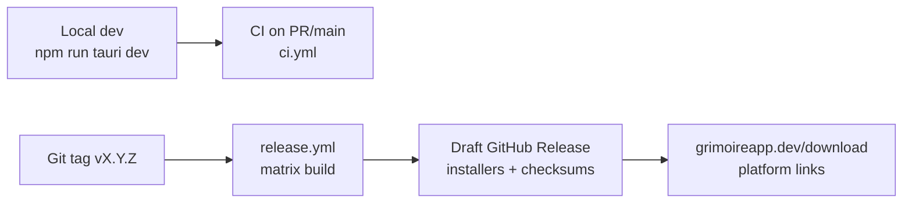

# Builds and installers

Single reference for how Grimoire is packaged, what CI produces, and how to fix common build failures. Maintainer checklist: [`.github/RELEASING.md`](../.github/RELEASING.md).

**Last verified:** 2026-06-30 — tag `v1.0.0-rc.2` ([release workflow](https://github.com/3ravens/Grimoire/actions/runs/28448850281)). All platform installers present: Windows NSIS `.exe`, Linux `.deb` + `.rpm` + `.AppImage`, macOS Intel + ARM `.dmg`, and per-platform `checksums-*.txt`. Windows installer SHA-256 verified locally against `checksums-windows.txt`.

---

## 1. Overview

A **Grimoire build** is a **Tauri v2** desktop application: Svelte frontend (`dist/`) + Rust backend (`src-tauri/`). It is **not** an Ollama bundle, model pack, or Wikipedia ZIM download.

| Platform | Architectures | Typical installer formats |
|----------|---------------|---------------------------|
| Windows | x64 | NSIS `.exe` (MSI disabled in `tauri.windows.conf.json` for semver prerelease tags like `1.0.0-rc.1`) |
| macOS | Apple Silicon (`aarch64`), Intel (`x86_64`) | `.dmg` containing `.app` |
| Linux | x64 | `.deb`, `.rpm`, `.AppImage` |



---

## 2. Repo map

| Path | Role |
|------|------|
| [`package.json`](../package.json) | npm scripts; version must match Cargo/Tauri config |
| [`src-tauri/tauri.conf.json`](../src-tauri/tauri.conf.json) | Bundle id `com.grimoire.app`, `bundle.targets`, Windows `bundle.resources`, WebView2 `skip` |
| [`src-tauri/build.rs`](../src-tauri/build.rs) | Windows: copy libzim DLLs → `target/<profile>/` and `nsis-dll-staging/`; vcpkg lib path; protoc detection |
| [`src-tauri/Cargo.toml`](../src-tauri/Cargo.toml) | App crate `app`; patches `zim-sys` / `zim-rs` from `vendor/` |
| [`vendor/zim-sys`](../vendor/zim-sys) | C++ bridge to **libzim**; Unix uses `pkg-config`, Windows links `zim` + vcpkg |
| [`vendor/zim-rs`](../vendor/zim-rs) | Safe Rust API over `zim-sys` |
| [`src-tauri/nsis-dll-staging/`](../src-tauri/nsis-dll-staging/) | **Generated** (gitignored); DLLs listed in `tauri.conf.json` for NSIS |
| [`src-tauri/vendor-dlls/`](../src-tauri/vendor-dlls/) | **Optional local mirror** (gitignored); copy of vcpkg `bin` DLLs for offline dev |
| [`.github/workflows/ci.yml`](../.github/workflows/ci.yml) | PR/main: tests on Win/macOS/Linux |
| [`.github/workflows/release.yml`](../.github/workflows/release.yml) | Tags `v*`: draft release + installers |
| [`scripts/ci/`](../scripts/ci/) | Shared install/checksum/version scripts; [`linuxdeploy-plugin-gtk.sh`](../scripts/ci/linuxdeploy-plugin-gtk.sh) (vendored Tauri GTK plugin with Wayland-lib patch for AppImage) |

---

## 3. Platform prerequisites

### Windows

| Requirement | Purpose |
|-------------|---------|
| **MSVC** (Visual Studio Build Tools) | Rust + C++ (`zim-bind.cc`) |
| **vcpkg** + `libzim:x64-windows` | Link `zim.lib`; runtime DLLs |
| **protoc** | LanceDB / Arrow (`PROTOC` env) |
| **WebView2 Runtime** | Tauri shell; installer does **not** bundle it (`webviewInstallMode: skip`) |

**Runtime DLLs** (must exist for **release** builds; copied into NSIS via `bundle.resources`):

`zim-9.dll`, `zstd.dll`, `liblzma.dll`, `icudt78.dll`, `icuin78.dll`, `icuio78.dll`, `icutu78.dll`, `icuuc78.dll`

Sources: `src-tauri/vendor-dlls/` or `%VCPKG_ROOT%\installed\x64-windows\bin`.

### macOS

| Requirement | Purpose |
|-------------|---------|
| **Xcode Command Line Tools** | clang, linker |
| **Homebrew** `libzim`, `protobuf`, `pkg-config` | Build `zim-sys`; protoc for LanceDB |
| **Rust targets** | `aarch64-apple-darwin`, `x86_64-apple-darwin` for release matrix |

### Linux (Ubuntu 24.04+ baseline for CI; 22.04+ for local dev)

| Package | Purpose |
|---------|---------|
| `libwebkit2gtk-4.1-dev`, GTK, ayatana, `librsvg2-dev` | Tauri WebKitGTK shell |
| `clang`, `pkg-config`; **libzim 9.x** via vcpkg in CI (local dev may use `libzim-dev` if API-compatible) | `zim-sys` via pkg-config (ICU/zstd transitives) |
| `protobuf-compiler` | protoc |
| `patchelf`, `libfuse2` | AppImage tooling |

CI installs these via [`scripts/ci/linux-deps.sh`](../scripts/ci/linux-deps.sh).

### Environment variables

| Variable | When |
|----------|------|
| `VCPKG_ROOT` | Windows; default `C:\vcpkg`, CI uses `$GITHUB_WORKSPACE/vcpkg` |
| `CXXFLAGS` | Windows MSVC include path for zim headers (see `.cargo/config.toml`) |
| `PROTOC` | Path to `protoc` if not on PATH |
| `LIBZIM_INCLUDE`, `LIBZIM_LIB` | Unix override if `pkg-config` fails |
| `PKG_CONFIG_PATH` | macOS Homebrew; CI sets via `macos-deps.sh` |

---

## 4. Build commands

From repo root:

| Command | Output |
|---------|--------|
| `npm install` | Node dependencies |
| `npm run tauri dev` | Dev app (Vite + Tauri) |
| `npm run build` | Frontend only → `dist/` |
| `npm run tauri:build` | Release installers → `src-tauri/target/release/bundle/` |
| `npm run check:frontend` | `build` + `npm test` |
| `bash scripts/ci/check-version-sync.sh` | Fails if versions drift |

From `src-tauri`:

| Command | Notes |
|---------|--------|
| `cargo test --locked` | Rust unit + integration tests |
| `cargo build --release` | Binary only; no installer |

**Windows debug vs release** ([`build.rs`](../src-tauri/build.rs)):

- **Debug:** missing DLLs → zero-byte placeholders in `nsis-dll-staging` so Tauri config validates; runtime/ZIM may still fail without real DLLs.
- **Release:** missing DLLs → **build error** (no shipping broken Wikipedia support).

---

## 5. Installer artifacts per OS

Tauri writes bundles under:

```text
src-tauri/target/release/bundle/
  msi/ or nsis/     (Windows)
  dmg/              (macOS)
  deb/ rpm/ appimage/  (Linux)
```

### Windows

- **NSIS** installer includes the app plus DLLs from `bundle.resources` (`nsis-dll-staging/`).
- NSIS does **not** auto-include every DLL next to `app.exe` in `target/release/`; that is why `build.rs` stages into `nsis-dll-staging`.
- **WebView2** is not installed by the Grimoire installer; users need the Evergreen runtime.

### macOS

- Separate CI jobs build **Apple Silicon** (`aarch64-apple-darwin` on `macos-14`) and **Intel** (`x86_64-apple-darwin` on `macos-15-intel`).
- Expect Gatekeeper warnings until Developer ID signing + notarization exist.

### Linux

- **`.deb` / `.rpm`:** install system WebKitGTK/GTK dependencies via package manager if missing.
- **`.AppImage`:** may require `libfuse2`; some hosts need `--appimage-extract-and-run` if FUSE is unavailable.

---

## 6. What the installer does *not* include

| Not bundled | How users get it |
|-------------|------------------|
| **Ollama** | Installation wizard or manual install |
| **LLM models** | `ollama pull` / wizard |
| **Wikipedia ZIM files** | Settings → Wikipedia download |
| **Note vault** | Stored in SQLite under the app data directory; **preserved on default uninstall** (Windows: optional checkbox to delete all notes, settings, and history) |

App data (SQLite, LanceDB index) lives under the OS app data path for `com.grimoire.app` — see [README](../README.md#where-app-data-lives) and [first-run guide](./first-run.md).

---

## 7. CI and release pipeline

### `ci.yml` (pull requests and `main`)

1. `version-sync` — `check-version-sync.sh`
2. `license-audit` — `cargo deny check licenses` (`src-tauri/deny.toml`) + `npm run license:check` (production deps)
3. Matrix **test** on `windows-latest`, `macos-15-intel`, `macos-14`, `ubuntu-22.04`:
   - Install native deps (`scripts/ci/*`)
   - `npm ci`, `npm run build`, `npm test`
   - `cargo test --locked` in `src-tauri`
   - **Linux:** `npm run tauri build -- --debug --bundles deb` (deb-only smoke; full `.deb`/`.rpm`/`.AppImage` on release)
   - **macOS ARM:** `npm run tauri build -- --debug --bundles dmg`
   - **macOS Intel / Windows:** no Tauri bundle step in PR CI (release job validates packaging)

### `release.yml` (tags `v*`)

1. `version-sync` + `license-audit` (release tag must match app version; licenses must pass)
2. Same tests as CI
3. **publish** matrix (gated on both `test` and `license-audit`): Windows, Linux, macOS ARM, macOS Intel
4. `tauri-apps/tauri-action@v0` → **draft** GitHub Release (Linux `bundle.targets: "all"` → `.deb` + `.rpm` + `.AppImage`)
5. `checksum-bundles.sh` → `checksums-<platform>.txt` uploaded via `gh release upload`

### Reading failed jobs

| Error | Likely fix |
|-------|------------|
| `release build: missing DLL` | Run vcpkg `libzim:x64-windows`; check `vendor-dlls` or vcpkg `bin` |
| `pkg_config` / `libzim` not found | Install `libzim-dev` (Linux) or `brew install libzim` (macOS) |
| `protoc` not found | Install `protobuf-compiler` / set `PROTOC` |
| WebKitGTK / `webkit2gtk` | Run `linux-deps.sh` packages |
| AppImage FUSE | Install `libfuse2` on target machine |
| Version mismatch | Align three version files before tagging |

---

## 8. Versioning and tagging

All three must match before a release tag:

- `package.json` → `"version"`
- `src-tauri/Cargo.toml` → `version =`
- `src-tauri/tauri.conf.json` → `"version"`

Tag format: `v0.1.0`, `v1.0.0`, `v0.1.0-rc.1` (prerelease tags stay **prerelease** on GitHub until `v1.x` without `-`).

```bash
git tag v0.1.0
git push origin v0.1.0
```

Draft release → manual QA → publish → update download page.

---

## 9. Unsigned builds (current policy)

Installers are **unsigned** for the first public releases:

- **Windows:** SmartScreen “unknown publisher”
- **macOS:** Gatekeeper block / right-click Open
- **Linux:** no code signing on `.deb`/`.rpm`/AppImage by default

Each draft release includes **`checksums-*.txt`** (SHA-256). Users can verify downloads; checksums do **not** replace code signing.

**Future:** Authenticode (Windows), Developer ID + notarization (macOS), optional detached signatures (Linux).

---

## 10. Troubleshooting

### Windows: `release build: missing DLL`

1. Install vcpkg and `vcpkg install libzim:x64-windows`
2. Set `VCPKG_ROOT` if not `C:\vcpkg`
3. Optionally copy DLLs to `src-tauri/vendor-dlls/`
4. Rebuild: `npm run tauri:build`

### Unix: libzim / pkg-config

```bash
# Debian/Ubuntu
sudo apt install libzim-dev clang pkg-config protobuf-compiler

# macOS
brew install libzim protobuf pkg-config
```

If probe still fails: set `LIBZIM_INCLUDE` and `LIBZIM_LIB` to Homebrew or custom prefixes.

### Wikipedia broken after “green” CI

Debug builds may use **placeholder** DLLs on Windows. Only **release** installers guarantee real libzim binaries.

### AppImage will not start

Install `libfuse2`, or run with extract-and-run per AppImage docs.

### AppImage aborts on Wayland sessions (`EGL_BAD_PARAMETER`)

**Affected builds:** `v1.0.0-rc.2` and earlier AppImages fail to launch on hosts running an actual Wayland session (`XDG_SESSION_TYPE=wayland`). The window flashes white, then the app aborts with:

```text
Could not create default EGL display: EGL_BAD_PARAMETER.  Aborting...
```

**Cause:** those builds bundle older `libwayland-*` client libraries from the CI runner, which clash with the host's newer Wayland/Mesa ABI. The app forces `GDK_BACKEND=x11` and does not use Wayland directly; the bundled libs are unnecessary.

**Fixed in:** builds produced after the `linuxdeploy-plugin-gtk.sh` patch (see [`scripts/ci/AGENTS.md`](../scripts/ci/AGENTS.md)).

**Workaround for affected AppImages:**

```bash
./Grimoire_*.appimage --appimage-extract
mkdir -p /tmp/wayland-libs-backup
mv squashfs-root/usr/lib/libwayland-* /tmp/wayland-libs-backup/
./squashfs-root/AppRun
```

---

## 11. Related roadmap items

From the v1.0 release gate:

- **Update notifications** — implemented as **opt-in, notify-only**: when the user enables
  the check in Settings, the app reads `https://grimoireapp.dev/version.json` on launch and
  shows a banner/badge linking to the download page. No network call is made unless the user
  opts in, and there is no silent in-app apply (the `tauri-plugin-updater` background apply is
  deferred to v1.1). The release process **must publish/update `version.json`** for the
  check to detect a release — see [`.github/RELEASING.md`](../.github/RELEASING.md).
- **Dependency license audit** — implemented: `cargo deny check licenses`
  ([`src-tauri/deny.toml`](../src-tauri/deny.toml)) and `npm run license:check`
  (`license-checker-rseidelsohn`), both enforced by the `license-audit` CI job.
- **Production signing** — still a separate hardening pass (Authenticode / Developer ID + notarization).

---

## Quick links

- [Tauri prerequisites](https://v2.tauri.app/start/prerequisites/)
- [Tauri GitHub Actions guide](https://v2.tauri.app/distribute/pipelines/github/)
- [Performance FAQ](./performance-faq.md)
- [Search quality harness](./search-quality.md)
